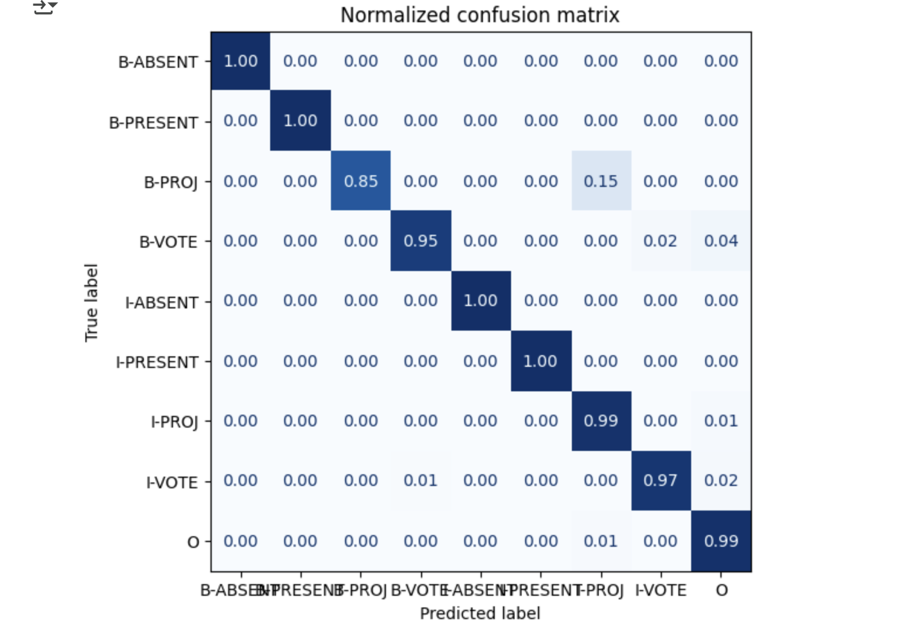
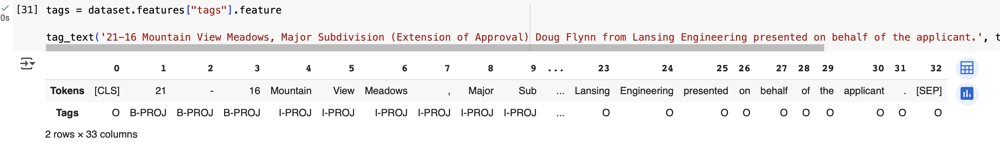
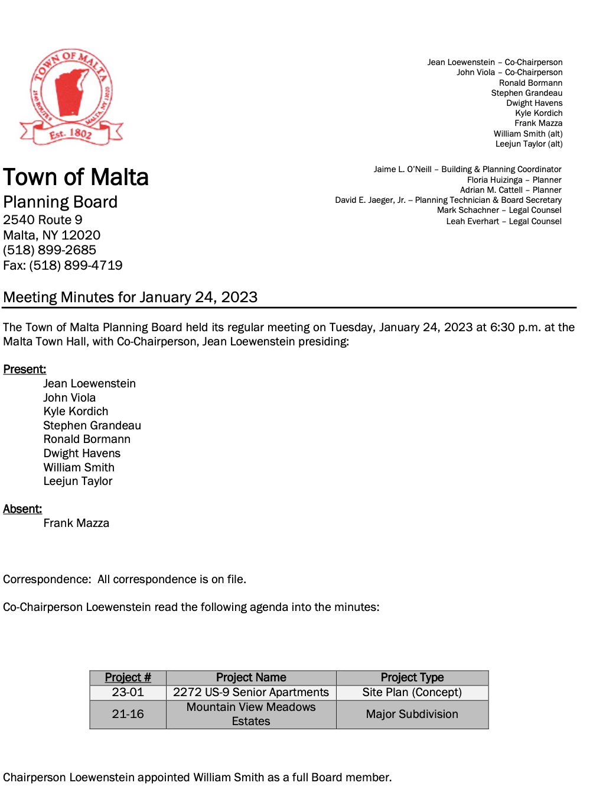

# 2025_ia653_randalla

# 2025_IA653_Randall

Readme for project

Motivation: This corpus was generated by the town of Malta, NY in their regular business and provided in PDF format.

Situation: This corpus consists of Planning Board Minutes from the Town of Malta. 

Language Variety: English

Speaker Demographics: Speakers include the Planning Board and people/representatives with business to discuss with the planning board.

Collection Process:  Planning board minutes from the past 2 years was collected.  New minutes are generated at each meeting.  These consist of PDF documents.Annotation process: 
Distribution: There are no limitations, this is publicly available meeting notes provided by the local government.

Outline - Generating data to show who/what/where type items were discussed in each of the various planning board meetings.  This can provide an easier way for people to look up minutes of interest to them.

* Process overview
    * There were several challenges with generating this final dataset.  The documents were provided in PDF format, which has some unique issues when converting to TXT.  These included ignoring headers/footers and cleaning up formatting issues.  It was mostly successful in cleaning up, but an effort could be focused on this issue alone.  I used some already available code to help expedite the process somewhat.  Forcing the data into the correct format proved challenging.  My original goal of generating more specific information proved to be too difficult for this process, but could be improved with further effort.  A significant portion of time went into trying to tag the text as best as I could and to iterate through the code to resolve type-errors.
    * The data was NER tagged manually and then fed back into the model.
    * Generating the data and ingesting it to the correct format was a significant hurdle to generate a working model.  
* EDA/Processing
    * The data was cleaned as much as possible from formatting inconsistencies, double new line characters and extra spaces were very common.  Iterating through a few steps to resolve the PDF reading issues resolve some of the extraneous information provided and seemed to be pretty consistent.   There were some files with different formats of summarizations that complicated the code a bit.
    * Data was extracted to the sentence using nltk and then keeping the case formatting.  I found this helped the model to detect names and places a little better than when it was lower-cased.
    *  Text was cleaned using a regex to remove duplicate non-printing characters.  Since it was split into sentences, new line characters were also removed.
    * 

* Production
    * A UI would need to be generated to wrap the interaction with this summarizer.   Since this was trained using a smaller dataset, it would need to have a person review before accepting the results.  The model performed very well on the meeting minutes attached.  
* Going further
    * Gathering more meeting notes or notes from other organizations would help give more NER tags to the model to work off of.  Including more data gathering type functionality would help to provide more use for the model.

Confusion matrix showing model performance.

